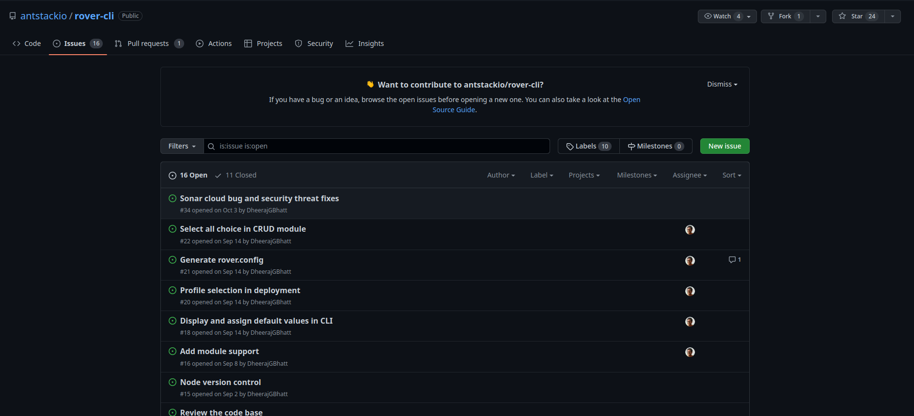
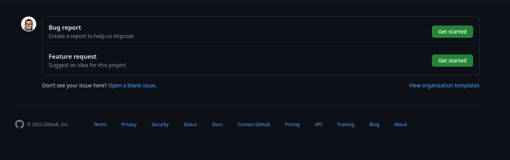
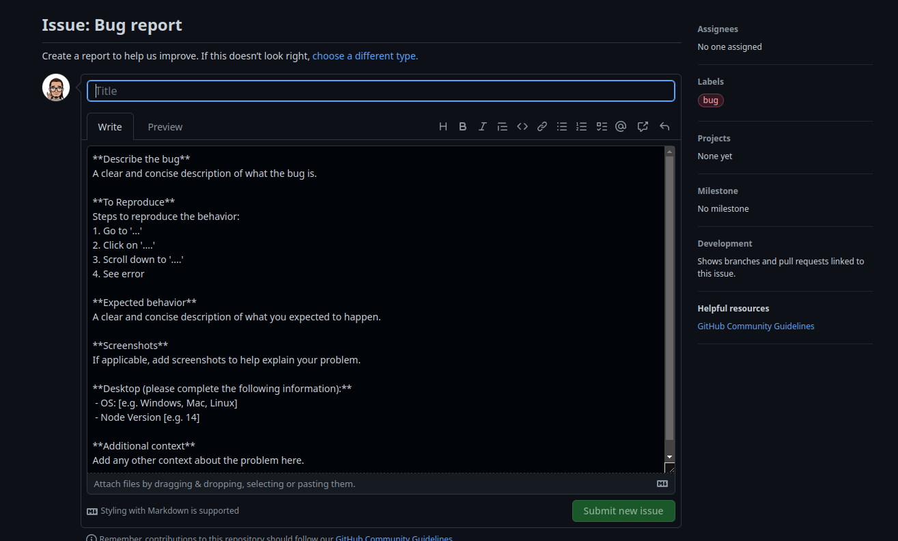
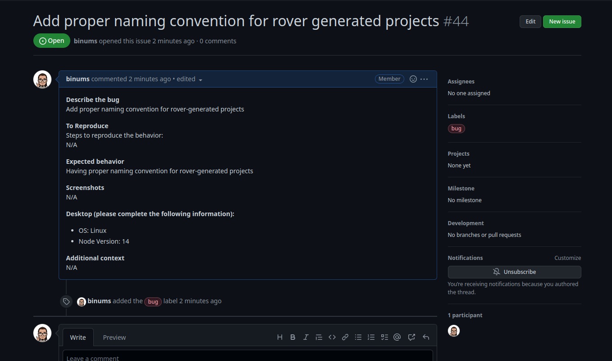
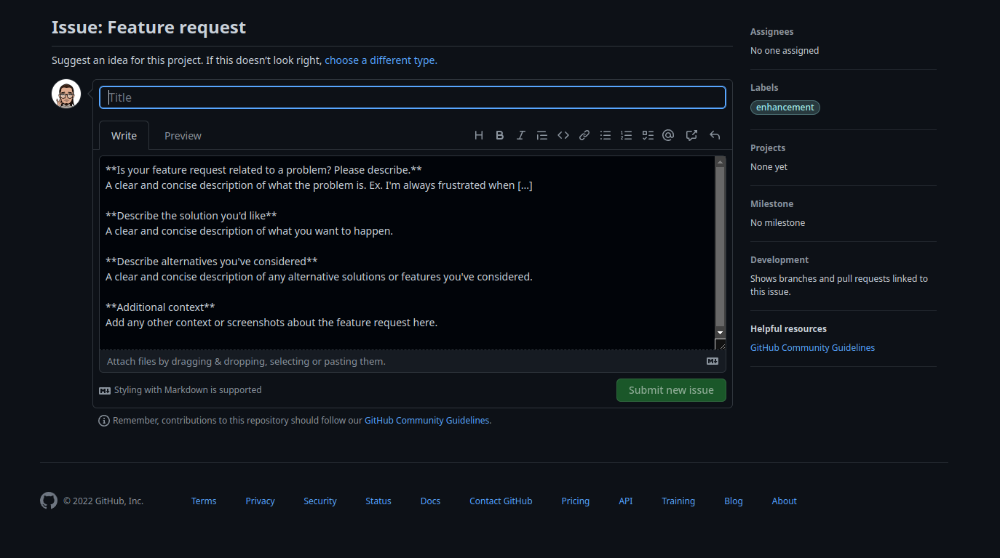
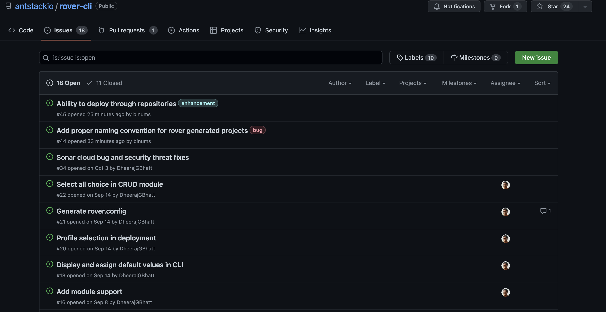

#  Bug Report or Feature Request

You can report a bug or request a feature by adding it in on our [GitHub Page](https://github.com/antstackio/rover-cli/issues)

Click on New Issue , you'll get two options as below,

### Bug Report

1. Click on Bug Report, you'll get a bug report format.

2. Report your bug in the given format

3. On submit new issue ,the issue will be recorded.

### Feature Request

1. If you click on Feature request, you'll get a feature request format.

2. Request your feature in the given format

On submit new issue ,the Feature Request will be recorded.

This will be the final issue list.

