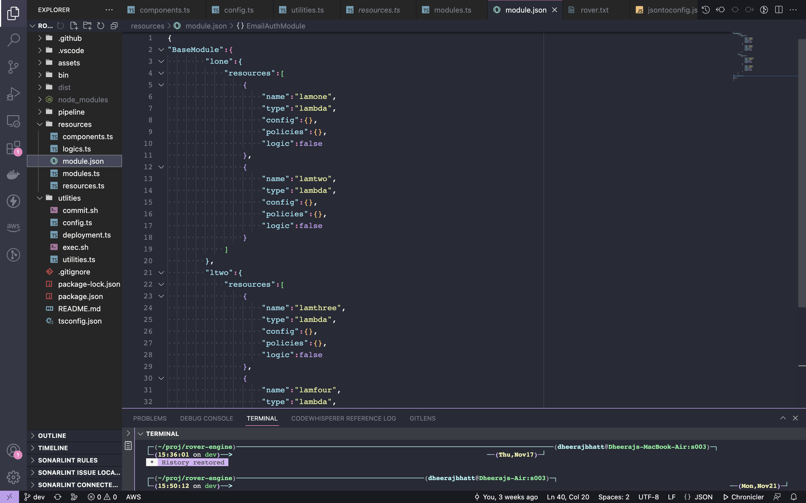
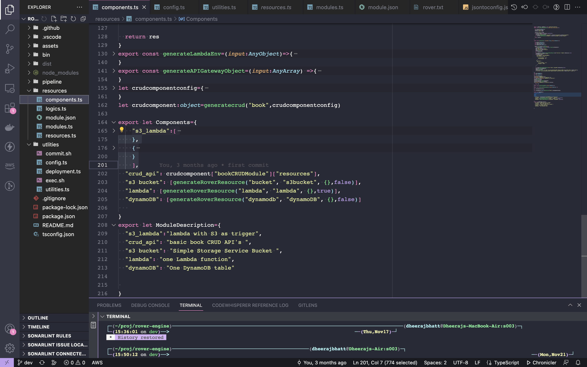

# Define New Components or Module


Rover has few predefined modules and components , so if you want to add new modules or components follow the below steps.


All modules and components are defined in   [rover-engine](https://github.com/antstackio/rover-engine) package, 
In packages there is directory called resources and within resources there is file called modules.ts,
and most of the modules are stored in modules.json file and its stored in this format.

#### Component Structure
```JSON
"Component Name":[
      {
        "name":"resource name",
        "type":"resource type ",
        "config":required configuration,
        "policies":required policies,
        "logic":whether logic is refined #only for lambda
    },
    .
    .
    .
],
                
},
```
#### Component Example
```JSON
"s3_lambda": [
    {
      "name": "lambdas",
      "type": "lambda",
      "config": {
        "Policies": [
          "AWSLambdaDynamoDBExecutionRole"
        ]
      },
      "logic": true
    },
    {
      "name": "Bucket",
      "type": "s3bucket",
      "config": {
        "CorsConfiguration": {
          "CorsRules": [
            {
              "AllowedHeaders": [
                "*"
              ],
              "AllowedMethods": [
                "GET",
                "PUT",
                "POST",
                "DELETE"
              ],
              "AllowedOrigins": [
                "*"
              ]
            }
          ]
        }
      }
    }
  ]
```

#### Module Structure
```JSON
"Module Name":{
    "Stack1 name":{
        "resource list":[
            {
                    "name":"resource name",
                "type":"resource type ",
                "config":required configuration,
                "policies":required policies,
                "logic":whether logic is refined #only for lambda
            },
            .
            .
            {}
            
        ]
    }
    .
    .
    {}
},
```
#### Module Example
```JSON
 "BaseModule": {
    "lone": {
      "resources": [
        {
          "name": "lamone",
          "type": "lambda",
          "config": {},
          "policies": {},
          "logic": false
        },
        {
          "name": "lamtwo",
          "type": "lambda",
          "config": {},
          "policies": {},
          "logic": false
        }
      ]
    },
    "ltwo": {
      "resources": [
        {
          "name": "lamthree",
          "type": "lambda",
          "config": {},
          "policies": {},
          "logic": false
        },
        {
          "name": "lamfour",
          "type": "lambda",
          "config": {},
          "policies": {},
          "logic": false
        }
      ]
    }
  }
```
### To add a module/component  and test

1. Both modules and components are defined in [rover-engine](https://github.com/antstackio/rover-engine)

 * Modules    - rover-engine/resources/module.json or rover-engine/resources/module.ts

 

 * Components - rover-engine/resources/components.ts

 


2. Define  your module/component in respective files as in step 1

3. Follow [Rover Set Up](Rover%20Set%20Up.mdx) , step 4 to install locally

4. Test your module/component  by running `rover init`.