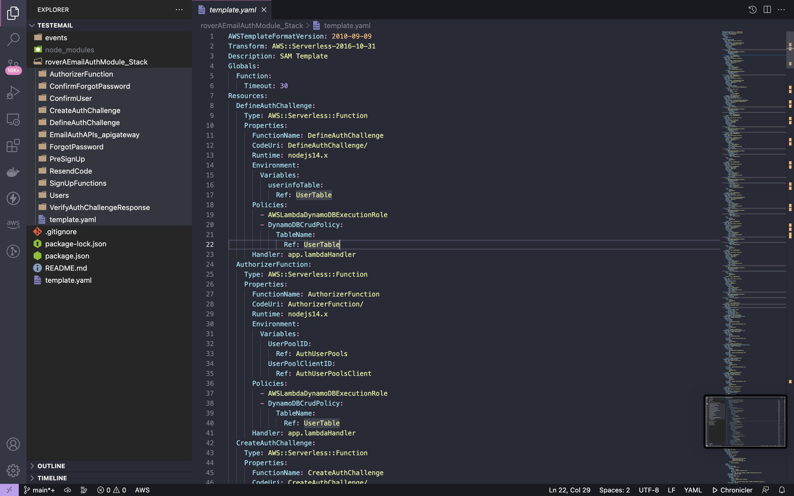

# Fix or Report Bug 


Email auth Module can be used to set email authentication using Cognito. This module helps in creating login using email authentication. 

``` shell
$ rover init                                                                                                                                                                                       
  Hey, what do you want ? create new SAM project
? App Name: testemail
? Choose your language Node
? Module Type : Email Auth Module : Authentication module using Cognito
? Do you want to add one more modules ?  No
```
Sample project structure





This is the sample infrastructure generated

```yml
AWSTemplateFormatVersion: 2010-09-09
Transform: AWS::Serverless-2016-10-31
Description: SAM Template
Globals:
  Function:
    Timeout: 30
Resources:
  DefineAuthChallenge:
    Type: AWS::Serverless::Function
    Properties:
      FunctionName: DefineAuthChallenge
      CodeUri: DefineAuthChallenge/
      Runtime: nodejs14.x
      Environment:
        Variables:
          userinfoTable:
            Ref: UserTable
      Policies:
        - AWSLambdaDynamoDBExecutionRole
        - DynamoDBCrudPolicy:
            TableName:
              Ref: UserTable
      Handler: app.lambdaHandler
  AuthorizerFunction:
    Type: AWS::Serverless::Function
    Properties:
      FunctionName: AuthorizerFunction
      CodeUri: AuthorizerFunction/
      Runtime: nodejs14.x
      Environment:
        Variables:
          UserPoolID:
            Ref: AuthUserPools
          UserPoolClientID:
            Ref: AuthUserPoolsClient
      Policies:
        - AWSLambdaDynamoDBExecutionRole
        - DynamoDBCrudPolicy:
            TableName:
              Ref: UserTable
      Handler: app.lambdaHandler
  CreateAuthChallenge:
    Type: AWS::Serverless::Function
    Properties:
      FunctionName: CreateAuthChallenge
      CodeUri: CreateAuthChallenge/
      Runtime: nodejs14.x
      Environment:
        Variables:
          SES_FROM_ADDRESS:
            Ref: VerifyAuthChallengeResponse
      Policies:
        - Version: 2012-10-17
          Statement:
            - Effect: Allow
              Action:
                - ses:SendEmail
              Resource: "*"
      Handler: app.lambdaHandler
  VerifyAuthChallengeResponse:
    Type: AWS::Serverless::Function
    Properties:
      FunctionName: VerifyAuthChallengeResponse
      CodeUri: VerifyAuthChallengeResponse/
      Runtime: nodejs14.x
      Environment:
        Variables:
          userinfoTable:
            Ref: UserTable
      Policies:
        - AWSLambdaDynamoDBExecutionRole
        - DynamoDBCrudPolicy:
            TableName:
              Ref: UserTable
            USERPOOLID:
              Ref: AuthUserPools
      Handler: app.lambdaHandler
  PreSignUp:
    Type: AWS::Serverless::Function
    Properties:
      FunctionName: PreSignUp
      CodeUri: PreSignUp/
      Runtime: nodejs14.x
      Environment:
        Variables:
          userinfoTable:
            Ref: UserTable
      Policies:
        - AWSLambdaDynamoDBExecutionRole
        - DynamoDBCrudPolicy:
            TableName:
              Ref: UserTable
      Handler: app.lambdaHandler
  SignUpFunctions:
    Type: AWS::Serverless::Function
    Properties:
      FunctionName: SignUpFunctions
      CodeUri: SignUpFunctions/
      Runtime: nodejs14.x
      Environment:
        Variables:
          UserPoolID:
            Ref: AuthUserPools
          UserPoolClientID:
            Ref: AuthUserPoolsClient
          userinfoTable:
            Ref: UserTable
      Policies:
        - AWSLambdaDynamoDBExecutionRole
        - DynamoDBCrudPolicy:
            TableName:
              Ref: UserTable
            USERPOOLID:
              Ref: AuthUserPools
      Role:
        Fn::GetAtt:
          - SignUpRoles
          - Arn
      Handler: app.lambdaHandler
  ResendCode:
    Type: AWS::Serverless::Function
    Properties:
      FunctionName: ResendCode
      CodeUri: ResendCode/
      Runtime: nodejs14.x
      Environment:
        Variables:
          UserPoolID:
            Ref: AuthUserPools
          UserPoolClientID:
            Ref: AuthUserPoolsClient
          userinfoTable:
            Ref: UserTable
      Policies:
        - AWSLambdaDynamoDBExecutionRole
        - DynamoDBCrudPolicy:
            TableName:
              Ref: UserTable
            UserPoolID:
              Ref: AuthUserPools
            UserPoolClientID:
              Ref: AuthUserPoolsClient
      Role:
        Fn::GetAtt:
          - SignUpRoles
          - Arn
      Handler: app.lambdaHandler
  ConfirmForgotPassword:
    Type: AWS::Serverless::Function
    Properties:
      FunctionName: ConfirmForgotPassword
      CodeUri: ConfirmForgotPassword/
      Runtime: nodejs14.x
      Environment:
        Variables:
          UserPoolID:
            Ref: AuthUserPools
          UserPoolClientID:
            Ref: AuthUserPoolsClient
          userinfoTable:
            Ref: UserTable
      Policies:
        - AWSLambdaDynamoDBExecutionRole
        - DynamoDBCrudPolicy:
            TableName:
              Ref: UserTable
            USERPOOLID:
              Ref: AuthUserPools
      Role:
        Fn::GetAtt:
          - SignUpRoles
          - Arn
      Handler: app.lambdaHandler
  ForgotPassword:
    Type: AWS::Serverless::Function
    Properties:
      FunctionName: ForgotPassword
      CodeUri: ForgotPassword/
      Runtime: nodejs14.x
      Environment:
        Variables:
          UserPoolID:
            Ref: AuthUserPools
          UserPoolClientID:
            Ref: AuthUserPoolsClient
          userinfoTable:
            Ref: UserTable
      Policies:
        - AWSLambdaDynamoDBExecutionRole
        - DynamoDBCrudPolicy:
            TableName:
              Ref: UserTable
            USERPOOLID:
              Ref: AuthUserPools
      Role:
        Fn::GetAtt:
          - SignUpRoles
          - Arn
      Handler: app.lambdaHandler
  ConfirmUser:
    Type: AWS::Serverless::Function
    Properties:
      FunctionName: ConfirmUser
      CodeUri: ConfirmUser/
      Runtime: nodejs14.x
      Environment:
        Variables:
          UserPoolID:
            Ref: AuthUserPools
          UserPoolClientID:
            Ref: AuthUserPoolsClient
          userinfoTable:
            Ref: UserTable
      Policies:
        - AWSLambdaDynamoDBExecutionRole
        - DynamoDBCrudPolicy:
            TableName:
              Ref: UserTable
      Role:
        Fn::GetAtt:
          - SignUpRoles
          - Arn
      Handler: app.lambdaHandler
  Users:
    Type: AWS::Serverless::Function
    Properties:
      FunctionName: Users
      CodeUri: Users/
      Runtime: nodejs14.x
      Environment:
        Variables:
          UserPoolID:
            Ref: AuthUserPools
          UserPoolClientID:
            Ref: AuthUserPoolsClient
          userinfoTable:
            Ref: UserTable
      Policies:
        - AWSLambdaDynamoDBExecutionRole
        - DynamoDBCrudPolicy:
            TableName:
              Ref: UserTable
      Role:
        Fn::GetAtt:
          - SignUpRoles
          - Arn
      Handler: app.lambdaHandler
  UserTable:
    Type: AWS::DynamoDB::Table
    Properties:
      TableName: UserTable
      KeySchema:
        - AttributeName: email
          KeyType: HASH
      AttributeDefinitions:
        - AttributeName: email
          AttributeType: S
      BillingMode: PAY_PER_REQUEST
  CreateAuthChallengeInvocationPermission:
    Type: AWS::Lambda::Permission
    Properties:
      FunctionName:
        Fn::GetAtt:
          - CreateAuthChallenge
          - Arn
      Principal: cognito-idp.amazonaws.com
      SourceArn:
        Fn::GetAtt:
          - AuthUserPools
          - Arn
      Action: lambda:InvokeFunction
  DefineAuthChallengeInvocationPermission:
    Type: AWS::Lambda::Permission
    Properties:
      FunctionName:
        Fn::GetAtt:
          - DefineAuthChallenge
          - Arn
      Principal: cognito-idp.amazonaws.com
      SourceArn:
        Fn::GetAtt:
          - AuthUserPools
          - Arn
      Action: lambda:InvokeFunction
  VerifyAuthChallengeResponseInvocationPermission:
    Type: AWS::Lambda::Permission
    Properties:
      FunctionName:
        Fn::GetAtt:
          - VerifyAuthChallengeResponse
          - Arn
      Principal: cognito-idp.amazonaws.com
      SourceArn:
        Fn::GetAtt:
          - AuthUserPools
          - Arn
      Action: lambda:InvokeFunction
  SignUpInvocationPermission:
    Type: AWS::Lambda::Permission
    Properties:
      FunctionName:
        Fn::GetAtt:
          - SignUpFunctions
          - Arn
      Principal: cognito-idp.amazonaws.com
      SourceArn:
        Fn::GetAtt:
          - AuthUserPools
          - Arn
      Action: lambda:InvokeFunction
  PreSignUpInvocationPermission:
    Type: AWS::Lambda::Permission
    Properties:
      FunctionName:
        Fn::GetAtt:
          - PreSignUp
          - Arn
      Principal: cognito-idp.amazonaws.com
      SourceArn:
        Fn::GetAtt:
          - AuthUserPools
          - Arn
      Action: lambda:InvokeFunction
  AuthUserPools:
    Type: AWS::Cognito::UserPool
    Properties:
      UserPoolName: AuthUserPools
      AutoVerifiedAttributes:
        - email
      EmailConfiguration:
        EmailSendingAccount: COGNITO_DEFAULT
      EmailVerificationMessage: Your verification code is {####}
      EmailVerificationSubject: Your verification code
      LambdaConfig:
        CreateAuthChallenge:
          Fn::GetAtt:
            - CreateAuthChallenge
            - Arn
        DefineAuthChallenge:
          Fn::GetAtt:
            - DefineAuthChallenge
            - Arn
        PreSignUp:
          Fn::GetAtt:
            - PreSignUp
            - Arn
        VerifyAuthChallengeResponse:
          Fn::GetAtt:
            - VerifyAuthChallengeResponse
            - Arn
      MfaConfiguration: 'OFF'
      Policies:
        PasswordPolicy:
          MinimumLength: 8
          RequireUppercase: true
          RequireLowercase: true
          RequireNumbers: true
          RequireSymbols: true
      Schema:
        - Name: name
          AttributeDataType: String
          Mutable: true
          Required: true
        - Name: email
          AttributeDataType: String
          Mutable: true
          Required: true
      UsernameAttributes:
        - email
  AuthUserPoolsClient:
    Type: AWS::Cognito::UserPoolClient
    Properties:
      UserPoolId:
        Ref: AuthUserPools
      ClientName: AuthUserPoolsClient
      ExplicitAuthFlows:
        - CUSTOM_AUTH_FLOW_ONLY
      GenerateSecret: false
  SignUpRoles:
    Type: AWS::IAM::Role
    Properties:
      AssumeRolePolicyDocument:
        Version: 2012-10-17
        Statement:
          - Effect: Allow
            Principal:
              Service:
                - apigateway.amazonaws.com
                - lambda.amazonaws.com
                - apigateway.amazonaws.com
            Action:
              - sts:AssumeRole
      Path: /
      Policies:
        - PolicyDocument:
            Version: 2012-10-17
            Statement:
              - Effect: Allow
                Action: lambda:InvokeFunction
                Resource:
                  Fn::Sub: arn:aws:lambda:*:${AWS::AccountId}:function:*
          PolicyName: lambdainvoke
        - PolicyDocument:
            Version: 2012-10-17
            Statement:
              - Effect: Allow
                Action: cognito-idp:ListUsers
                Resource:
                  Fn::Sub: arn:aws:cognito-idp:*:${AWS::AccountId}:userpool/*
          PolicyName: cognito
        - PolicyDocument:
            Version: 2012-10-17
            Statement:
              - Effect: Allow
                Action:
                  - dynamodb:GetItem
                  - dynamodb:DeleteItem
                  - dynamodb:PutItem
                  - dynamodb:Scan
                  - dynamodb:Query
                  - dynamodb:UpdateItem
                  - dynamodb:BatchWriteItem
                  - dynamodb:BatchGetItem
                  - dynamodb:DescribeTable
                  - dynamodb:ConditionCheckItem
                Resource:
                  - Fn::Sub: arn:aws:dynamodb:${AWS::Region}:${AWS::AccountId}:table/UserTable
                  - Fn::Sub: arn:aws:dynamodb:${AWS::Region}:${AWS::AccountId}:table/UserTable/index/*
          PolicyName: dynamodbcrud
      RoleName: SignUpRoles
      ManagedPolicyArns:
        - arn:aws:iam::aws:policy/service-role/AWSLambdaBasicExecutionRole
        - arn:aws:iam::aws:policy/service-role/AmazonAPIGatewayPushToCloudWatchLogs
  AllowSetUserAttributes:
    Type: AWS::IAM::Policy
    Properties:
      PolicyName: AllowSetUserAttributes
      Roles:
        - Ref: SignUpRoles
      PolicyDocument:
        Version: 2012-10-17
        Statement:
          - Effect: Allow
            Action: cognito-idp:AdminUpdateUserAttributes
            Resource:
              Fn::GetAtt:
                - AuthUserPools
                - Arn
  EmailAuthAPIs:
    Type: AWS::Serverless::Api
    Properties:
      Name: EmailAuthAPIs
      StageName: dev
      DefinitionBody:
        Fn::Transform:
          Name: AWS::Include
          Parameters:
            Location: EmailAuthAPIs_apigateway/swagger.yaml
  ClientApiKey:
    Type: AWS::ApiGateway::ApiKey
    Properties:
      Name: ClientApiKey
      Enabled: true
      StageKeys:
        - RestApiId:
            Ref: EmailAuthAPIs
          StageName: dev
    DependsOn:
      - EmailAuthAPIs
      - EmailAuthAPIsdevStage
  ClientOrderUsagePlan:
    Type: AWS::ApiGateway::UsagePlan
    Properties:
      UsagePlanName: ClientOrderUsagePlan
      ApiStages:
        - ApiId:
            Ref: EmailAuthAPIs
          Stage: dev
      Description: Client Orders's usage plan
      Throttle:
        BurstLimit: 5
        RateLimit: 5
    DependsOn:
      - ClientApiKey
  ClientOrderUsagePlanKey:
    Type: AWS::ApiGateway::UsagePlanKey
    Properties:
      KeyId:
        Ref: ClientApiKey
      KeyType: API_KEY
      UsagePlanId:
        Ref: ClientOrderUsagePlan
    DependsOn:
      - ClientOrderUsagePlan
  CognitoAuthorizer:
    Type: AWS::ApiGateway::Authorizer
    Properties:
      Name: CognitoAuthorizer
      RestApiId:
        Ref: EmailAuthAPIs
      Type: COGNITO_USER_POOLS
      IdentitySource: method.request.header.authorization
      ProviderARNs:
        - Fn::GetAtt:
            - AuthUserPools
            - Arn

```
