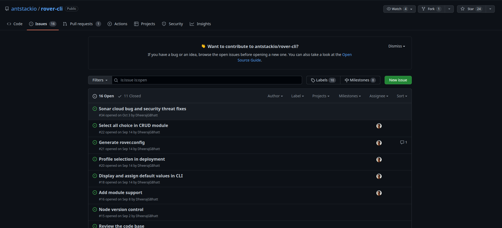
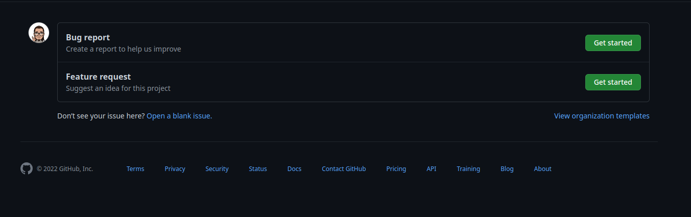
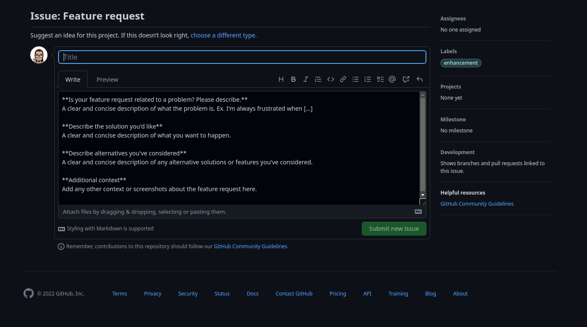
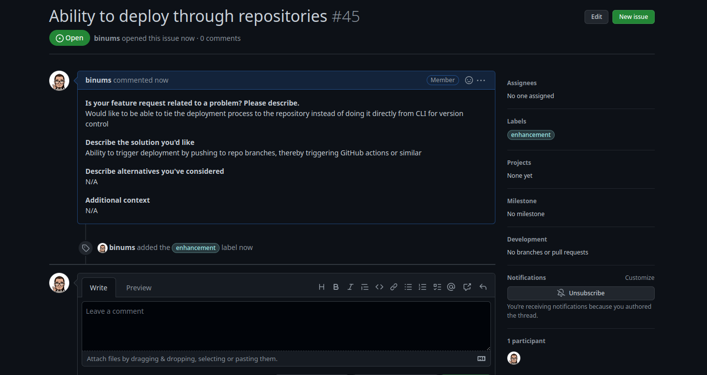
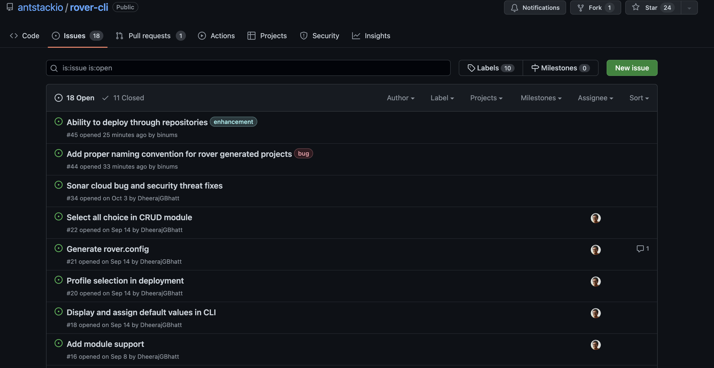

#  Bug Report or Feature Request

You can report a bug or request a feature by adding it in out [GitHub Page](https://github.com/antstackio/rover-cli/issues)

Click on New Issue

you'll get two options as below,

### Bug Report

1. Click on Bug Report.

2. Report your bug in the given format

On submit new issue ,the issue will be recorded.

### Feature Request

1. If you click on Feature request.

2. Request your feature in the given format

On submit new issue ,the Feature Request will be recorded.

This will be the final issue list.

