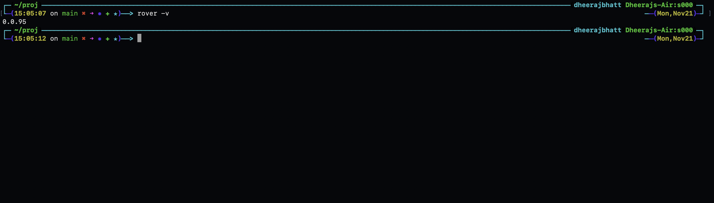

# Rover Set Up


Rover can be set up locally to test or to contribute, So to run it locally:


### Pre-requisites

* [Python3](https://www.python.org/downloads/)

* [AWS SAM](https://docs.aws.amazon.com/serverless-application-model/latest/developerguide/install-sam-cli.html)

* [TypeScript](https://www.npmjs.com/package/typescript)

* [AWS CLI](https://docs.aws.amazon.com/cli/latest/userguide/getting-started-install.html)


### Local setup
1.  First fork  [rover-engine](https://github.com/antstackio/rover-engine) and [rover-cli](https://github.com/antstackio/rover-cli) to your GitHub account.
 
and  clone rover-engine
```sh
  git clone https://github.com/username/rover-engine.git
```

then clone rover-cli
```sh
  git clone https://github.com/username/rover-cli.git
```

2.  Install dependencies,

```sh
cd  rover-cli && npm install && cd ..
```


```sh
cd  rover-engine &&  npm install && cd ..
```


3.  In rover-cli update the localtest script in package.json,replace the folder path with yours

```sh
npm pkg set scripts.localtest="npm install your_file_path/rover-engine && npm run build && npm install your_file_path/rover-cli -g "  
```

4.  To install loaclly run 

For rover-cli
```sh
npm run localtest   
```

For rover-engine
```sh
cd rover-engine
```

```sh
npm run build
```

now on running 
```sh
rover -v 
```
you should get the version.




<b>Note</b> for any change in rover-cli or rover-engine  you need to run the above commands.
 