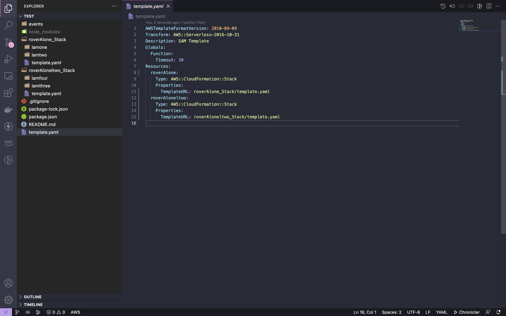

# Base Module


This is a sample module with 2 lambdas in 2 stacks.

``` shell
$ rover init                                                                                                                                                                                        ──(Thu,Oct13)─┘
                                                                                                                       ──(Thu,Oct13)─┘
  Hey, what do you want ? create new SAM project
  App Name: test
  Choose your language Node
  Module Type : Base Module : It’s a module with 2 stacks and 2 lambdas in each stack 
  Do you want to add one more modules ?  No


```

Sample project structure





This the sample infrastructure generated

Template in root of project folder
test / template.yaml
```yml
AWSTemplateFormatVersion: 2010-09-09
Transform: AWS::Serverless-2016-10-31
Description: SAM Template
Globals:
  Function:
    Timeout: 30
Resources:
  roverAlone:
    Type: AWS::CloudFormation::Stack
    Properties:
      TemplateURL: roverAlone_Stack/template.yaml
  roverAloneltwo:
    Type: AWS::CloudFormation::Stack
    Properties:
      TemplateURL: roverAloneltwo_Stack/template.yaml
```
Stack one template 
test / roverAlone_Stack / template.yaml
```yml
AWSTemplateFormatVersion: 2010-09-09
Transform: AWS::Serverless-2016-10-31
Description: SAM Template
Globals:
  Function:
    Timeout: 30
Resources:
  lamone:
    Type: AWS::Serverless::Function
    Properties:
      FunctionName: lamone
      CodeUri: lamone/
      Runtime: nodejs14.x
      Handler: app.lambdaHandler
  lamtwo:
    Type: AWS::Serverless::Function
    Properties:
      FunctionName: lamtwo
      CodeUri: lamtwo/
      Runtime: nodejs14.x
      Handler: app.lambdaHandler

```
Stack two template 
test / roverAloneltwo_Stack / template.yaml
```yml
AWSTemplateFormatVersion: 2010-09-09
Transform: AWS::Serverless-2016-10-31
Description: SAM Template
Globals:
  Function:
    Timeout: 30
Resources:
  lamthree:
    Type: AWS::Serverless::Function
    Properties:
      FunctionName: lamthree
      CodeUri: lamthree/
      Runtime: nodejs14.x
      Handler: app.lambdaHandler
  lamfour:
    Type: AWS::Serverless::Function
    Properties:
      FunctionName: lamfour
      CodeUri: lamfour/
      Runtime: nodejs14.x
      Handler: app.lambdaHandler

```
