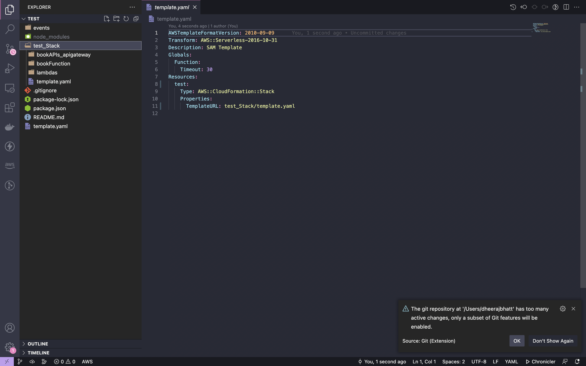

# Customizable


Customizable module can be used to create our own modules using Components. We can select the components provided by rover and create our own modules.

``` shell
$ rover init                                                                                                                                                                                        ──(Thu,Oct13)─┘
  Hey, what do you want   create new SAM project
  App Name: test
  Choose your language Node
  Module Type : Customizable : Create your own Module
  Stack 1 Name:  test
  Please select your App_type : s3_lambda, crud_api
  Do you want to add one more modules    No
```

Sample project structure




This is the sample infrastructure generated

```yml
AWSTemplateFormatVersion: 2010-09-09
Transform: AWS::Serverless-2016-10-31
Description: SAM Template
Globals:
  Function:
    Timeout: 30
Resources:
  lambdas:
    Type: AWS::Serverless::Function
    Properties:
      FunctionName: lambdas
      CodeUri: lambdas/
      Runtime: nodejs14.x
      Policies:
        - AWSLambdaDynamoDBExecutionRole
      Handler: app.lambdaHandler
  Bucket:
    Type: AWS::S3::Bucket
    Properties:
      BucketName: Bucket
      CorsConfiguration:
        CorsRules:
          - AllowedHeaders:
              - "*"
            AllowedMethods:
              - GET
              - PUT
              - POST
              - DELETE
            AllowedOrigins:
              - "*"
  bookRoles:
    Type: AWS::IAM::Role
    Properties:
      AssumeRolePolicyDocument:
        Version: 2012-10-17
        Statement:
          - Effect: Allow
            Principal:
              Service:
                - apigateway.amazonaws.com
                - lambda.amazonaws.com
                - apigateway.amazonaws.com
            Action:
              - sts:AssumeRole
      Path: /
      Policies:
        - PolicyDocument:
            Version: 2012-10-17
            Statement:
              - Effect: Allow
                Action: lambda:InvokeFunction
                Resource:
                  Fn::Sub: arn:aws:lambda:*:${AWS::AccountId}:function:*
          PolicyName: lambdainvoke
        - PolicyDocument:
            Version: 2012-10-17
            Statement:
              - Effect: Allow
                Action:
                  - dynamodb:GetItem
                  - dynamodb:DeleteItem
                  - dynamodb:PutItem
                  - dynamodb:Scan
                  - dynamodb:Query
                  - dynamodb:UpdateItem
                  - dynamodb:BatchWriteItem
                  - dynamodb:BatchGetItem
                  - dynamodb:DescribeTable
                  - dynamodb:ConditionCheckItem
                Resource:
                  - Fn::Sub: arn:aws:dynamodb:${AWS::Region}:${AWS::AccountId}:table/bookTable
                  - Fn::Sub: arn:aws:dynamodb:${AWS::Region}:${AWS::AccountId}:table/bookTable/index/*
          PolicyName: dynamodbcrud
      RoleName: bookRoles
      ManagedPolicyArns:
        - arn:aws:iam::aws:policy/service-role/AWSLambdaBasicExecutionRole
        - arn:aws:iam::aws:policy/service-role/AmazonAPIGatewayPushToCloudWatchLogs
  bookAPIs:
    Type: AWS::Serverless::Api
    Properties:
      Name: bookAPIs
      StageName: dev
      DefinitionBody:
        Fn::Transform:
          Name: AWS::Include
          Parameters:
            Location: bookAPIs_apigateway/swagger.yaml
  bookFunction:
    Type: AWS::Serverless::Function
    Properties:
      FunctionName: bookFunction
      CodeUri: bookFunction/
      Runtime: nodejs14.x
      Environment:
        Variables:
          Table:
            Ref: bookTable
      Policies:
        - AWSLambdaDynamoDBExecutionRole
        - DynamoDBCrudPolicy:
            TableName:
              Ref: bookTable
      Handler: app.lambdaHandler
  bookTable:
    Type: AWS::DynamoDB::Table
    Properties:
      TableName: bookTable
      KeySchema:
        - AttributeName: id
          KeyType: HASH
      AttributeDefinitions:
        - AttributeName: id
          AttributeType: S
      BillingMode: PAY_PER_REQUEST

```
